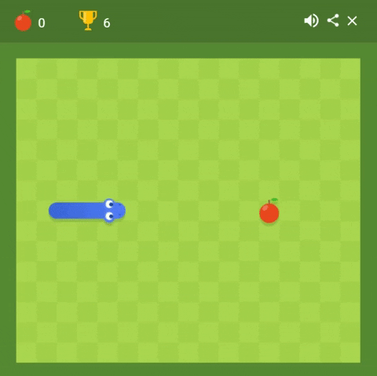

# Snake-Game-146

### Hi there,  

&nbsp;

## I am krishnakant !! 

### Connect with me:

&nbsp;&nbsp;&nbsp;
 &nbsp; &nbsp; &nbsp; 

You can play : https://kant146.github.io/Snake-Game-146/
<h3 align="center" >Here i made <b>Snake Game</> for  New generation kids , where you can play with more fun </h3>

<h3 align="center" > Audience: I know you are trying to show us that old game </h3>

<h3 align="center" >Me: Trust me it's different & better </h3>

<h3 align="center" > Audience: Still feel same but we know who gonna love this </h3>

